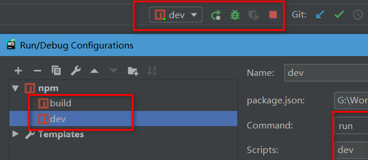
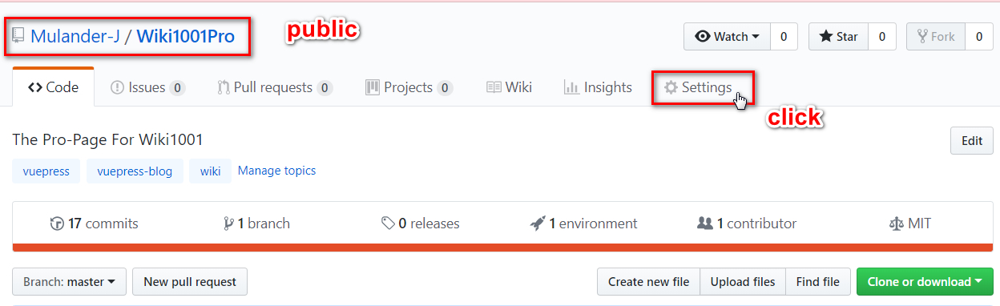
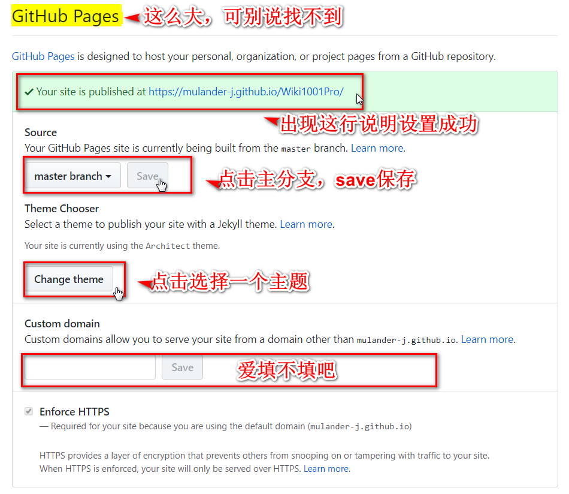
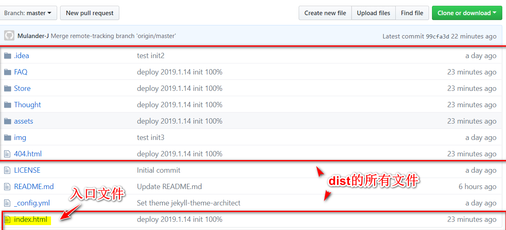
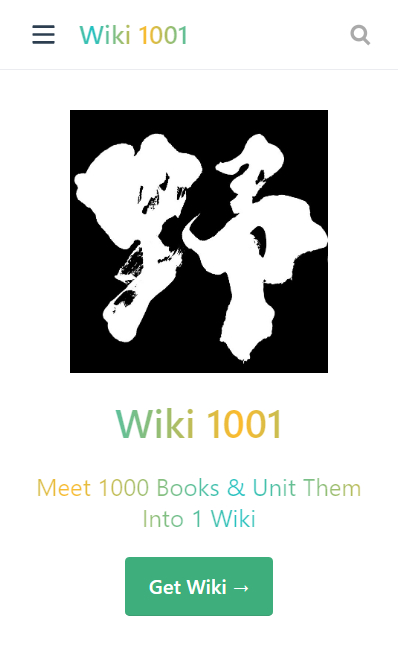
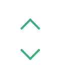
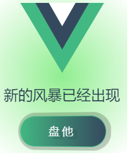
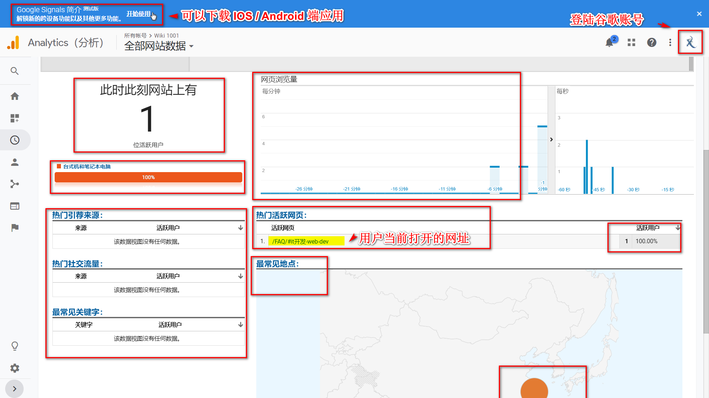
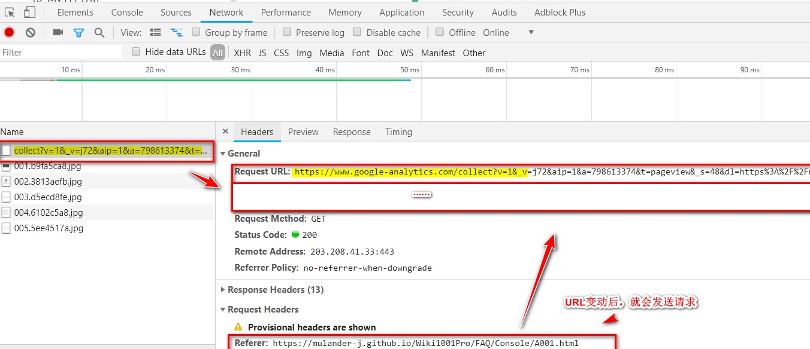

# Wiki1001 
>- [博客预览](https://mulander-j.github.io/fillory/Wiki1001/) 
>- [模板预览←](https://mulander-j.github.io/wiki1001/)
>- [精简模板源码←](https://github.com/Mulander-J/wiki1001)


## Serve & Build
```
npm run dev
npm run build
```

## 00.契子
- 偶尔的整理洁癖
- 平常有收藏+书签的习惯
- github私有仓库免费开放
- 翻看博文 ： [作为软件工程师，如何进行知识管理](https://segmentfault.com/a/1190000017824320)

## 01.需求分析 ##

Ok，因为以上的四个契机，因缘巧合鬼使神差地 ，就做出了搭建一个 **实用性** 个人博客的想法。

Well,那就来先分析下基本的需求吧。

- **个人博客** => **博文产出&支持MarkDown格式&方便管理和维护**
- **知识库** => **知识归纳&习惯培养**

初步设定：

- 将各应用中的书签导入到博客中，在博客中有一块区域负责对知识的消化与产出

- 配合对云仓库和随笔这两个模块的管理来培养习惯

## 02.可行性分析 ##

这时我想要的博客是能在 任意场所 任意时间 任意平台 都能打开即食用的，对所有的知识/书签/博文都能做一个快速的查询,而且不想花钱搭建云服务器和云数据库。
正好我目前正在使用vue框架，那么就决定是你了，VuePress ！

基于VuePress搭建的项目有很多，就举最近看到并在食用的这个，[awesome-bookmarks](https://panjiachen.github.io/awesome-bookmarks/)为例，整体满足我的需求，感觉可以的。

...程序员施工中...

目前使用下来看，VuePress上手不算难也不算太简单，花了两天才正式撸出这个blog，还是费了些二虎之力的。

使用的技术点：

- VuePress
- githubPage

追加技术点：

- vue 
- Regex
- Valine

## 03.数据源和工具准备 ##
- 数据
    - [awesome-bookmarks](https://panjiachen.github.io/awesome-bookmarks/)
    - [前端最实用书签(持续更新)](https://segmentfault.com/a/1190000016420985)
- 工具
    - 博客编译器[VuePress官方文档](https://vuepress.vuejs.org/zh/)
    - 依赖安装器1[node.js>=8.0](https://nodejs.org/en/)
    - 依赖安装器2[Yarn](https://yarn.bootcss.com/)
    - 文本编辑器(比如[webstorm](http://www.jetbrains.com/webstorm/),主要用来可视化执行命令)

## 04.开始搭建博客 ##

首先引用官网的原文重申一次**VuePress**博客搭建的过程：

> Start
 **As Easy as 1, 2, 3**

```bash
# install
yarn global add vuepress@next 
# OR npm install -g vuepress@next

# create a markdown file
echo '# Hello VuePress' > README.md

# start writing
vuepress dev

# build to static files
vuepress build

```

**VuePress**的官网目前是存在多个版本的，分别为稳定的x.x版本和最新的x.x的alpha版本。
在实际开发中，我经常因为混淆版本而导致一些插件不能正常引入。

- 0.x 的文档: [v0.vuepress.vuejs.org](https://v0.vuepress.vuejs.org/)

- 1.x 的文档: [v1.alpha.vuepress.vuejs.org](https://vuepress.vuejs.org/zh/)

如果是开发者，建议安装最新版**VuePress**，体验最新的轮子~

```bash
yarn add vuepress -D       # Install 0.x.x.稳定版本
yarn add vuepress@next -D  # Install next.最新版本
```

安装 

1.安装程序 node.js 或者 Yarn。VuePress支持使用Yarn和npm来安装，Node.js版本需要>=8才可以。

此处选择熟悉的工具即可，这里用的是npm。

2.打开cmd，在控制台输入以下代码：

全局安装VuePress
```
yarn global add vuepress # 或者：npm install -g vuepress

## 或者也可以在已存在的项目中开发，将 VuePress 作为一个本地依赖安装，
## 区别是安装位置的不同，前者在一个公共目录可以被所有项目引用，后者只存在与当前项目私有
## 上下两条选择一个即可，此处选择上者，省点折腾。

## yarn add -D vuepress # 或者：npm install -D vuepress
```
创建并进入新项目目录
```
mkdir project
cd project
```
初始化项目，生产package.json文件
```
yarn init -y # 或者 npm init -y
```
接着，在 package.json 里加一些脚本:
```
{
  "scripts": {
    "docs:dev": "vuepress dev docs",
    "docs:build": "vuepress build docs"
  }
}
/* 
 * docs:dev 键值可以自定义修改，此处是为了和一些项目中默认脚本中自带的 dev 区分开。
 * 控制台输入命令 'npm run doc:dev' 等同与 输入 'vuepress dev docs' 。
 * 'vuepress dev doc' 做的就是调用安装的vuepress去根据你目录中的.vuepress配置项和docs下的所有.md/.html文件做一个项目的编译和打包。
 * docs:build 同理 
 */
```
然后就可以开始写作了:
```
yarn docs:dev # 或者：npm run docs:dev
```
要生成静态的 HTML 文件，运行：
```
yarn docs:build # 或者：npm run docs:build
```
默认情况下，文件将会被生成在 `.vuepress/dist`，当然，你也可以通过 `.vuepress/config.js `中的 `dest` 字段来修改，生成的文件可以部署到任意的静态文件服务器上.

不习惯命令行输入的也可以直接依靠GUI操作建立如下工程目录。
```
project
├─── docs
│   └── README.md
└── package.json

```
在README.md中输入一些内容，在package.json中注入脚本命令。并将命令挂载到webstorm的命令配置处。
然后点击运行run dev ，run build 来自动生成.vuepress文件夹


```
project
├─── docs
│   ├── README.md
│   └── .vuepress
│       ├── dist
│       ├── public
│       └── config.js
└── package.json
```
不管使用哪种方式，最终的项目结构应该和上面一样。
- docs文件夹是你的根目录，也是vuepress要去解析的文件夹，
- docs下的README.md可以理解为首页页面。
- docs下的.vuepress是一些配置文件，这里可以存放图片等静态资源，一些主题配置，自定义组件等等

至此，一个基于docs文件夹下的README.md文件 生成的页面 就 制作完成了。👏

## 05.基本目录结构 ##

本博客的工程目录结构-版本以编辑时间为准，

可配合上文 config.js 关联配置

```
Dev
├─── docs
│   └── .vuepress   // 配置目录
│   │    ├── public // 静态资源
│   │    ├──── img
│   │    ├────── geass-bg.ico // 图标
│   │    ├────── logo.jpg // 首页logo
│   │    └── config.js
│   ├── FAQ // 求索模块
│   │    ├── Console    // 一级目录 输出层
│   │    │      ├── img    // 博文引用 的 相关图片
│   │    │      │   ├── A001    // A001博文的图片库
│   │    │      │   └──── 001.jpg   
│   │    │      ├── A001.md    // 输出层
│   │    │      └── A002.md    // 输出层
│   │    ├── DigestionHeap // 一级目录 消化堆
│   │    │      ├── Digested.md    // 二级目录 消化过
│   │    │      ├── Digesting.md    // 二级目录 消化中
│   │    │      └── DigestWill.md    // 二级目录 待消化
│   │    ├── Pool // 静态池
│   │    │      ├── SkillStack.md    // 技术栈
│   │    │      └── Review.md    // 归去来
│   │    └── README.md  // 求索首页
│   ├── Thought
│   │    ├── Travels    // 一级目录 游记
│   │    │      └── beiPing.md   
│   │    ├── YearReview // 一级目录 年终回顾
│   │    │      ├── img    // 博文引用 的 相关图片
│   │    │      │   ├── 2018    // 2018博文的图片库
│   │    │      │   ├──── 001.jpg   
│   │    │      │   ├─——─ 002.jpg   
│   │    │      │   └──── 003.jpg   
│   │    │      ├── 2018.md    
│   │    │      └── 2019.md   
│   │    └── README.md  // 随笔首页
│   └── README.md   // 博客首页
└── package.json
```

## 06.config.js基本配置 ##

**注意事项**
- 和**图标/图片**等静态资源相关的 其 '/'  默认指向的是 **docs/.vuepress/public/**
- 和**侧边栏/导航栏**相关的地址配置 其 '/'  默认指向的是 **docs/**
- 侧边栏/导航栏指向.md文件的需要**先建立相关.md文件**，不然会报404或者页面空白

```js{7}
module.exports = {
    title: 'Wiki 1001', // 页签标题 : A001_VuePress博客搭建的简单教程&问题分析 # | Wiki 1001
    description: '金志相的 Wiki 1001 维基百科', // meta 中的描述文字，意义不大，SEO用
    // 注入到当前页面的 HTML <head> 中的标签
    head: [
        // 增加一个自定义的 favicon(网页标签的图标)
        // 这里的 '/' 指向 docs/.vuepress/public 文件目录 
        // 即 docs/.vuepress/public/img/geass-bg.ico
        ['link', { rel: 'icon', href: '/img/geass-bg.ico' }], 
    ],
    base: '/wiki1001/', // 这是部署到github相关的配置
    markdown: {
        lineNumbers: true // 代码块显示行号
    },
 }
```
config.js中继续配置主题参数 **顶部导航栏**
```js{9}
module.exports = {
    ...
    themeConfig: {
        sidebarDepth: 4, // e'b将同时提取markdown中h2 和 h3 标题，显示在侧边栏上。
        lastUpdated: 'Last Updated' ,// 文档更新时间：每个文件git最后提交的时间,
        // 顶部导航栏
        nav:[
             // 单项 text：显示文字，link：指向链接
             // 这里的'/' 指的是 docs文件夹路径
             // [以 '/' 结尾的默认指向该路径下README.md文件]
            { text: '求索', link: '/FAQ/' },  // http://localhost:8080/Wiki1001Pro/FAQ/
            { text: '仓库', link: '/Store/' },
            { text: '随笔', link: '/Thought/' },
            // 多项，下拉形式
            {
                text: 'Concat',
                items: [
                    // link：指向链接也可以是外网链接
                    { text: 'Segmentfault', link: 'https://segmentfault.com/u/mulander' },
                ]
            }
        ],
    }
}
```
config.js中继续配置主题参数 **侧边栏**
```js{15}
module.exports = {
   ...
   themeConfig: {
   ...
    // 侧边栏菜单( 一个模块对应一个菜单形式 )
    sidebar:{
         // 打开FAQ主页链接时生成下面这个菜单
        '/FAQ/':[
            //多级菜单形式
            {
                // 菜单名
                title: '消化堆',
                // 子菜单
                children: [
                    // ['','']=>[路径,标题]
                    // 或者写成 '路径',标题自动识别为该地址的文件中的h1标题
                    // 不以 '/' 结尾的就是指向.md文件             
                    ['/FAQ/DigestionHeap/Digested','消化过'], // '/FAQ/DigestionHeap/Digested.md'文件
                    ['/FAQ/DigestionHeap/Digesting','消化中'],
                    ['/FAQ/DigestionHeap/DigestWill','待消化']
                ]
            },
            {
                title: '输出层',
                children: [
                    ['/FAQ/Console/A001','#A001_VuePress'],
                    ['/FAQ/Console/A002','#A002_插件清单']
                ]
            },
            ['/FAQ/','百科首页'],
            ['/FAQ/Pool/SkillStack','技术栈'],
            ['/FAQ/Pool/Review','归去来']
        ],
         // 打开Thought主页链接时生成下面这个菜单
        '/Thought/':[
            ['/Thought/','随笔首页'],
            {
                title: '年终回顾',
                children: [
                   ['/Thought/YearReview/2018','2018年'],
                   ['/Thought/YearReview/2019','2019年']
                ]
            },
        ]
    },
}
```

## 07.博客首页 ##

```

---
home: true
heroImage: /img/logo.jpg
heroText: Wiki 1001
tagline: Meet 1000 Books & Unit Them Into 1 Wiki
actionText: Get Wiki →
actionLink: /FAQ/
features:
- title: Wiki - 求索
  details: 基于书签对知识点进行 整理，吸收，吐纳，归档。吾将上下而求索...
- title: Store - 仓库
  details: 展望云仓库而归纳整理，方便行事&培养习惯。鱼和熊掌我全都要...
- title: Thought - 随笔
  details: 活着，是一件最能带来满足感的事。细细琢磨吧，人生啊，有意思的很...
footer: MIT Licensed | Copyright © 2019.01.11-present Mulander-J
---

```


oops！ 😀 **footer** 没截到 ，应该不用了吧。

## 08.导入书签 ##
首先，从Chrome浏览器中出的书签是下面这个格式的
  ```html
   <DT><H3 ADD_DATE="1547274523" LAST_MODIFIED="1547274529">myGits</H3>
      <DL><p>
          <DT><A HREF="https://mulander-j.github.io/Wiki1001Pro/index.html" ADD_DATE="1547274505">Wiki 1001</A>
          <DT><A HREF="https://mulander-j.github.io/timeWaster/demo/index.html#/" ADD_DATE="1546489726" ICON="data:image/png;base64,iVBORw0KGgoAAAANSUhEUgAAABAAAAAQCAYAAAAf8/9hAAACpElEQVQ4jT2Su29cZRDFfzPfd+8+/FrjKI4TiEAWiJcQ/AGUdPQpaBB/EhIFDR3/AEKyUAoKkNKBgUgUIGEFRzJ+xbte7+7de785FGs4zZFG8zhnZgzg20dfvNWH9ZIsqgpoWaGqVtz+F1ihi2KGyvHJ5e/286dfv+699AMwCiIwsMAwQLcVtiKBzIyIUD/V3kZ8lqveYGipbEnqmQwzIBkqgQ0yRYXUgG6bmBnuFr2qdnXdpoe6EBRJAgUQgVSaTvW9DZ0PG11Pr2VmEhFShFYiJEXxNtwQELAaD4YRpbD+8ksMHm5zdPGcprQk81VOCEnmDj70UFRm9N1ow0pbTI4pZPXuho0e3LGmbe345tRuFo1pGea9yuglonTmXXRGF4zTgnhlSH+0RswapKC9uGF2Nia5czO+5tKnpNc2meSGq+sxs2VLXlLTlxhO4PjqGTvvPeT+u/u8+PEILQvRBtWgZv+jDzDg6PCI9mrOzvoILPC6WhJAVfd4kHb4+/FTjucXbHz8BtPZDdF0vPPoQ/qjNY4ODimThlyvrtOWFqetb/cS5F7Fq5t77N3b4+TZc07OT1FbmD6/pF7rgSD3KkwgRARkKpAMwyjLjrW7I4S4//4+63dHmBmzf8bMzyas744o8xZPjptTvOC5ZJlJhskk+Xatp9880U+fH8hAucr65cvH+uvgUOu7WyIkd5NhZGXlliVuq7/1KjE/m5AbWMwafvvqe3JV0Y7nJJzZ6eR/C26uIMgWbigQUoSULOnOcMsJaX45JaVEdetfi07myQwLg5SyWQZvs5mnqvYSgZkxyDWD3OfFfMJy0TLsDXAMM8cNJNKg6rPomi6f//nrH7tvvv1JKdo2984oRkBlibU8oO1auhKkBElQBLjZomu6MuW7fwHKV31zU2eghQAAAABJRU5ErkJggg==">TWaster</A>
      </DL><p>
  </DT>
  ```
可以直接用下面这种vue写法替代
```html
<ul>
    <li  v-for="a in [
    {title:'让我帮你百度一下',url:'http://baidu.apphb.com/'},
    {title:'Kaspersky Cyberthreat',url:'https://cybermap.kaspersky.com/'},
    {title:'Breathingearth',url:'http://www.breathingearth.net/'}
    ]">
        <a :href='a.url' target='_blank'>{{a.title}}<svg xmlns="http://www.w3.org/2000/svg" aria-hidden="true" x="0px" y="0px" viewBox="0 0 100 100" width="15" height="15" class="icon outbound"><path fill="currentColor" d="M18.8,85.1h56l0,0c2.2,0,4-1.8,4-4v-32h-8v28h-48v-48h28v-8h-32l0,0c-2.2,0-4,1.8-4,4v56C14.8,83.3,16.6,85.1,18.8,85.1z"></path> <polygon fill="currentColor" points="45.7,48.7 51.3,54.3 77.2,28.5 77.2,37.2 85.2,37.2 85.2,14.9 62.8,14.9 62.8,22.9 71.5,22.9"></polygon></svg></a>
    </li>
</ul>
```
这样写确实比编着号写方便，但是语义不强，阅读性和维护性不太好。

```markdown
[链接](http://alink.com)
```
```html
<DL><p>
    <DT><A HREF="https://mulander-j.github.io/Wiki1001Pro/index.html" ADD_DATE="1547274505">Wiki 1001</A>
    <DT><A HREF="https://mulander-j.github.io/timeWaster/demo/index.html#/" ADD_DATE="1546489726" ICON="data:image/png;base64,iVBORw0KGgoAAAANSUhEUgAAABAAAAAQCAYAAAAf8/9hAAACpElEQVQ4jT2Su29cZRDFfzPfd+8+/FrjKI4TiEAWiJcQ/AGUdPQpaBB/EhIFDR3/AEKyUAoKkNKBgUgUIGEFRzJ+xbte7+7de785FGs4zZFG8zhnZgzg20dfvNWH9ZIsqgpoWaGqVtz+F1ihi2KGyvHJ5e/286dfv+699AMwCiIwsMAwQLcVtiKBzIyIUD/V3kZ8lqveYGipbEnqmQwzIBkqgQ0yRYXUgG6bmBnuFr2qdnXdpoe6EBRJAgUQgVSaTvW9DZ0PG11Pr2VmEhFShFYiJEXxNtwQELAaD4YRpbD+8ksMHm5zdPGcprQk81VOCEnmDj70UFRm9N1ow0pbTI4pZPXuho0e3LGmbe345tRuFo1pGea9yuglonTmXXRGF4zTgnhlSH+0RswapKC9uGF2Nia5czO+5tKnpNc2meSGq+sxs2VLXlLTlxhO4PjqGTvvPeT+u/u8+PEILQvRBtWgZv+jDzDg6PCI9mrOzvoILPC6WhJAVfd4kHb4+/FTjucXbHz8BtPZDdF0vPPoQ/qjNY4ODimThlyvrtOWFqetb/cS5F7Fq5t77N3b4+TZc07OT1FbmD6/pF7rgSD3KkwgRARkKpAMwyjLjrW7I4S4//4+63dHmBmzf8bMzyas744o8xZPjptTvOC5ZJlJhskk+Xatp9880U+fH8hAucr65cvH+uvgUOu7WyIkd5NhZGXlliVuq7/1KjE/m5AbWMwafvvqe3JV0Y7nJJzZ6eR/C26uIMgWbigQUoSULOnOcMsJaX45JaVEdetfi07myQwLg5SyWQZvs5mnqvYSgZkxyDWD3OfFfMJy0TLsDXAMM8cNJNKg6rPomi6f//nrH7tvvv1JKdo2984oRkBlibU8oO1auhKkBElQBLjZomu6MuW7fwHKV31zU2eghQAAAABJRU5ErkJggg==">TWaster</A>
</DL><p>

```
- 1. Ctrl+F 或者 Ctrk+R 唤出文档寻找和替换菜单 
- 2. 输入 `" ADD_DATE[^>]*">` 替换为 `)[`
- 3. 输入 `<DT><A HREF="`  替换为 `(`
- 4. 输入 `<DL><p>` 替换为 ''
- 5. 输入 `</DL><p>` 替换为 ''
得到结果如下
```markdown
(http://alink.com)[链接]
```
- 6.然后选中链接或者链接标题移动一下就可以了。
这样所有的链接都出来了，只是要每个都去加回车换行和互换前后顺序。

## 09.挂载GitHub Page ##

将博客挂载在githubPage，简单的说就是创建一个github仓库并向其推送博客文件。

首先，可被推送的文件可大致分为三类：

- A: doc/.vuepress下的配置文件，可能包含主题开发或者一些应用ID密钥配置（隐私）。 
- B: doc目录下的markdown文件即待编译文件。
- C: dist目录，build编译打包生成的静态文即实际访问的页面。(注意dist文件无法add的话要在.gitignore文件中去除忽略)

其次利用Github来挂载静态页面有以下有三种方式：

- 1.本地pc端存储A、B，将A、B、C都推送至github
- 2.本地pc端存储A、B，仅将C推送至github
- 3.本地pc端存储A、B，将A、B推送至github1（私有）、将C推送至github2（公开）

我的个人博客采用方法3，模板项目采用方法1。

模板仓库中C单独存放在gh-page分支，A、B存放在master分支

`git subtree push --prefix dist origin gh-pages`

参考[git subtree](https://www.jianshu.com/p/d42d330bfead)

挂载githubPage流程

- 建立一个公有仓库 ： https://github.com/Mulander-J/wiki1001

- 在 **setting** 里设置好github-page属性

- docs/.vuepress/config.js 中配置 对应仓库名 wiki1001
```js
base: '/wiki1001/'// 这是部署到github相关的配置
```
- 将build获得的dist文件夹上传至github

- 访问（默认请求index.html文件） https://mulander-j.github.io/wiki1001/

## 10.添加Github链接  ##

与github关联的页脚链接（点击编辑原文与最后更新）和右上角链接

```js{2}
/**
* config.js
* @type {{themeConfig: {lastUpdated: string, repoLabel: string, 
* docsDir: string, repo: string, editLinkText: string, 
* docsRepo: string, editLinks: boolean, docsBranch: string}}}
*/
module.exports = {
    // ...
    themeConfig: {
          // 右上角链接、假定是 GitHub. 同时也可以是一个完整的 GitLab URL
          repo: 'https://github.com/Mulander-J/wiki1001.git',
          // 自定义仓库链接文字。默认从 `themeConfig.repo` 中自动推断为
          // "GitHub"/"GitLab"/"Bitbucket" 其中之一，或是 "Source"。
          repoLabel: 'GitHub',
          // 以下为可选的编辑链接选项
          // 假如你的文档仓库和项目本身不在一个仓库
          // 即【3.本地pc端存储A、B，将A、B推送至github1（私有）、将C推送至github2（公开）】
          docsRepo: 'https://github.com/Mulander-J/wiki1001',
          // 假如文档不是放在仓库的根目录下：
          docsDir: 'docs',
          // 假如文档放在一个特定的分支下：
          docsBranch: 'master',
          // 默认是 false, 设置为 true 来启用
          editLinks: false,
          // 默认为 "Edit this page"
          editLinkText: 'Git EditLink [Private]',
          // 文档更新时间：每个文件git最后提交的时间,
          lastUpdated: 'Last Updated' ,
    }
}
```


## 11.个性化主题 ##

### 主题修改 ###

- 下载默认主题
```bash
npm install @vuepress/theme-default@next
```
- 替换

复制node_modules/@vuepress/theme-default 文件夹,
粘贴至.vuepress/ 下并更名为theme

```
Dev
├─── docs
│   ├── .vuepress   // 配置目录
│   │    ├── public // 静态资源
│   │    ├── theme // 主题
│   │    │   ├── components // 组件
│   │    │   ├── global-components // 全局组件
│   │    │   ├── global-components // 全局组件
│   │    │   ├── layouts // 布局(包括首页在内)
│   │    │   ├── styles // 样式
│   │    │   ├── util // 工具
│   │    │   ├── index.js // 入口配置
│   │    │   ├── noopModule.js // 依赖注入
│   │    │   ├── package.json // 主题依赖
│   │    │   └── README.md // 主题说明
│   │    └── config.js
│   ├── FAQ     // 求索模块
│   ├── Thought // 随笔模块
│   └── README.md   // 博客首页
└── package.json
```
- 运行
```bash
npm run dev
```

接下来就可以对这份theme项目作修改了，

它就是载负你的博客的一个简单的VUe单页面项目。

### 滚动条样式 ### 

设置页面滚动条为渐变色&圆角样式


```css{0}
/*定义滚动条高宽及背景 高宽分别对应横竖滚动条的尺寸*/
::-webkit-scrollbar
{
  width: 8px;
  height: 8px;
  border-radius: 10px;
  background-color: #F5F5F5;
}

/*定义滚动条轨道 内阴影+圆角*/
::-webkit-scrollbar-track
{
  border-radius: 10px;
  -webkit-box-shadow: inset 0 0 6px rgba(0,0,0,0.3);
  background-color: #F5F5F5;
}

/*定义滑块 内阴影+圆角*/
::-webkit-scrollbar-thumb
{
  border-radius: 10px;
  -webkit-box-shadow: inset 0 0 6px rgba(0,0,0,.3);
  border-radius: 10px;
  /* 线性渐变 */
  background-image: -webkit-gradient(linear, 
  left bottom, left top,
   color-stop(0.44, rgb(60,186,146)), 
   color-stop(0.72, rgb(253,187,45)), 
   color-stop(0.86, rgb(253,187,45)));
  transition: 0.3s ease-in-out;
}
/*定义滑块悬浮样式*/
::-webkit-scrollbar-thumb:hover{
  background-image: -webkit-gradient(linear, 
  left bottom, left top, 
  color-stop(0.44, rgb(253,187,45)), 
  olor-stop(0.72, rgb(253,187,45)), 
  color-stop(0.86, rgb(60,186,146)));
  transition: 0.3s ease-in-out;
}

```

### 渐变色标题 ###



```css{0}
h1{
  background-image: -webkit-linear-gradient(left,
   #22c1c3, #fdbb2d 25%, #22c1c3 50%, #fdbb2d 75%, #22c1c3);
  -webkit-text-fill-color: transparent;
  -webkit-background-clip: text;
  -webkit-background-size: 200% 100%;
  -webkit-animation: myGradientChange 4s infinite linear;
  animation: myGradientChange 4s infinite linear;
}
.description,.card h2{
  background-image: -webkit-linear-gradient(left,
   #fdbb2d, #22c1c3 25%, #fdbb2d 50%, #22c1c3 75%, #fdbb2d);
  -webkit-text-fill-color: transparent;
  -webkit-background-clip: text;
  -webkit-background-size: 200% 100%;
  -webkit-animation: myGradientChange 4s infinite linear;
  animation: myGradientChange 4s infinite linear;
}
@keyframes myGradientChange  {
  0%{ background-position: 0 0;}
  100% { background-position: -100% 0;}
}
```

### GoToEnd ###



- 下载官方组件BackToTop
```bash
npm install @vuepress/plugin-back-top@next
```
- 本地化BackToTop组件至Layout.vue中，包括首页在内都会生产该组件
```vue{0}
//  复制node_modules/@vuepress/plugin-back-top/BackToTop.vue
//  粘贴至.vuepress/theme/components
<template>
  <div>
    <BackToTop></BackToTop>
  </div>
</template>

<script>
import BackToTop from '../components/BackToTop.vue'
export default {
  components: { BackToTop},
}
</script>

```
- 修改Back To Top 组件

复制一个Back To Top DOM节点同时修改 **transition** 为 **transition-group**
```vue{0}
<template>
  <transition-group name="fade">
    <svg
      v-if="topShow"
      class="go-to-top"
      key="goTop"
      @click="scrollToTop"
      xmlns="http://www.w3.org/2000/svg" viewBox="0 0 49.484 28.284"
    >
      <g transform="translate(-229 -126.358)">
        <rect fill="currentColor" width="35" height="5" rx="2" transform="translate(229 151.107) rotate(-45)"/>
        <rect fill="currentColor" width="35" height="5" rx="2" transform="translate(274.949 154.642) rotate(-135)"/>
      </g>
    </svg>
    <svg
            v-if="endShow"
            class="go-to-top go-to-end"
            @click="scrollToEnd"
            key="goEnd"
            xmlns="http://www.w3.org/2000/svg" viewBox="0 0 49.484 28.284"
    >
      <g transform="translate(-229 -126.358)">
        <rect fill="currentColor" width="35" height="5" rx="2" transform="translate(229 151.107) rotate(-45)"/>
        <rect fill="currentColor" width="35" height="5" rx="2" transform="translate(274.949 154.642) rotate(-135)"/>
      </g>
    </svg>
  </transition-group>
</template>
```
增加 变量 **scrollEnd** , **endShow** 

方法 **getScrollEnd()** ,**scrollToEnd()**

```vue{0}
<script>
import debounce from 'lodash.debounce'
export default {
  props: {
    threshold: {
      type: Number,
      default: 300
    }
  },
  data () {
    return {
      scrollTop: null,
      scrollEnd: null
    }
  },
  mounted () {
    this.scrollTop = this.getScrollTop()
    this.scrollEnd = this.getScrollEnd()
    window.addEventListener('scroll', debounce(() => {
      this.scrollTop = this.getScrollTop()
      this.scrollEnd = this.getScrollEnd()
    }, 100))
  },
  methods: {
    getScrollTop () {
      return window.pageYOffset ||
        document.documentElement.scrollTop ||
        document.body.scrollTop || 0
    },

    getScrollEnd () {
      return document.documentElement.scrollHeight ||
              document.body.scrollHeight || this.threshold
    },
    scrollToTop () {
      window.scrollTo({ top: 0, behavior: 'smooth' })
      this.scrollTop = 0
    },

    scrollToEnd () {
      window.scrollTo({ top: this.scrollEnd, behavior: 'smooth' })
      this.scrollTop = this.scrollEnd
    }
  },
  computed: {
    topShow () {
      return this.scrollTop > this.threshold
    },
    endShow () {
      return (this.scrollEnd - this.scrollTop) > 3*this.threshold
    }
  }
}
</script>
```
增加置底按钮样式，z轴旋转180度
```vue{0}
<style lang='stylus' scoped>
.go-to-top {
  cursor: pointer;
  position: fixed;
  bottom: 5rem;
  right: 2.5rem;
  width: 2rem;
  color: $accentColor;
  z-index: 1;
}
.go-to-end{
  bottom: 2rem;
  transform: rotateZ(180deg);
}
.go-to-top:hover {
  color: lighten($accentColor, 30%);
}

@media (max-width: 959px) {
  .go-to-top {
    display: none;
  }
}
.fade-enter-active, .fade-leave-active {
  transition: opacity 0.3s;
}
.fade-enter, .fade-leave-to {
  opacity: 0;
}
</style>
```

## 12.插件 ##

### PWA
serviceWorker的作用大致就页面首次加载时会请求本地的serviceWorker.js去比对各个文件的版本号，如果不一致则提示用户拉取更新。
serviceWorker.js每次打包后都会更新。

```bash
yarn add -D @vuepress/plugin-pwa
# OR npm install -D @vuepress/plugin-pwa
```
```js{0}
//config,js
module.exports = {
// ...
 plugins: [
    ['@vuepress/pwa', {
        serviceWorker: true,
        //指向自定义组件
        popupComponent: 'MySWUpdatePopup',
        updatePopup: {
            message: "新的风暴已经出现",
            buttonText: "盘他"
        }
    }]
 ]
}
```
不过这个popup的默认样式很丑😨，所以官方也提供了自定义popup的接口和教程

改造后：



>注意
``v-if="enabled"`` // 添加这一段指令，否则popup无法消失

```vue{2}
<SWUpdatePopup>
    <div   v-if="enabled" 
            slot-scope="{ enabled, reload, message, buttonText }"
            class="my-sw-update-popup">
        {{ message }}<br>
        <button @click="reload">{{ buttonText }}</button>
    </div>
</SWUpdatePopup>
```

### 插件-google-analytics

- ~~首先你要有一个谷歌账号，~~
- ~~然后有一个 google analytics（GA）账户~~
- ~~然后...~~
- ~~不用麻烦了不用麻烦了~~
- ~~不用麻烦 不用麻烦了 不用麻烦了~~
- ~~你们一起上 我在赶时间~~
- [如何注册并设置google analytics（GA）账户](https://jingyan.baidu.com/article/066074d6093cf8c3c21cb0e3.html)
- **GA-ID ゲットだゼーツ！**



- 安装并使用 **google_analysis**

```bash
yarn add -D @vuepress/plugin-google-analytics
# OR npm install -D @vuepress/plugin-google-analytics
```
```js{0}
//config.js
module.exports = {
...
  plugins: [
    ['@vuepress/google-analytics', {
        ga: '*********'//你的Google Analytics ID
    }],
  ]
}
```
**google_analysis** 会实时监控你的**url**，倘若一个页面有多个h2,h3标题，滑动滚动条导致**url**的变化也会被捕捉到。



### 评论系统-Valine
>P.S Valine目前版本已更新，支持vuepress插件模式安装

- 获取APP ID 和 APP Key,请先登录或注册 **LeanCloud**, 进入控制台后点击左下角创建应用
- 安装并使用 **Valine**
```bash
# Install leancloud's js-sdk
npm install leancloud-storage --save
# Install valine
npm install valine --save
```
```js{0}
// Register AV objects to the global
window.AV = require('leancloud-storage');
// Use import
import Valine from 'valine';
// or Use require
const Valine = require('valine');
new Valine({
    el:'#vcomments',
    // other config
})
```
```vue{0}
//Page.vue
<script>
export default {
     mounted: function(){
        // require window 
        const Valine = require('valine');
        if (typeof window !== 'undefined') {
          this.window = window
          window.AV = require('leancloud-storage')
        }
        new Valine({
          el: '#vcomments' ,
          appId: '',// your appId
          appKey: '', // your appKey
          notify:false, //邮箱通知，可关闭
          verify:false, //反人类的算术验证码，建议关闭
          avatar:'mm', //头像，默认即可
          visitor: true,//访问计数
          placeholder: 'just go go' 
        });
      }
}
</script>
```
> `Issue`
不管地址栏怎么变化，不管怎么切页面，评论内容不会随地址栏变化而变化，即无法随页面同步。

**Valine**实例与**leancloud-storage**实例 在每次页面加载时会向服务器发起
带当前url参数的请求以获取评论数据，而这个url参数每次都是一样。

首先**Valine** 实例与 **leancloud-storage** 实例都在 **mounted** 钩子中初始化或挂载至 **window** 对象上了，

当页面 **url** 变化时，**Page.vue** 本身并没有变化，只是它身上的`<Content/>`内容变了，**mounted**没有重新触发，上面两个实例也没有改变。

**`P.S.血的教训`**

不要在 md 文件中直接写`<Content/>`,请用其他格式编译它，否则会被**vuepress**识别为组件而不断加载陷入死循环。
```js{0}
[Vue warn]: Error in nextTick: "RangeError: Maximum call stack size exceeded"
warn @ vue.runtime.esm.js?2b0e:601
vue.runtime.esm.js?2b0e:1832 RangeError: Maximum call stack size exceeded
```
```markdown{2}
Exp:
只是它身上的<Content/>内容变了，
只是它身上的`<Content/>`内容变了，
```

- 如果重新 init 两个实例呢？
    - 通过 **watch $route** 重新 **new** 两个实例也不行。
    - 在每个页面单独写入 带 **Valine** 的.vue组件也不行。  

---
解决 Valine 不随页面刷新 , Page.vue 改动如下：
```
<script>
import...
export default {
   // 初始化Valine组件
  mounted() {
    this.renderValine()
  },
  watch :{
     // 路由变化时重新初始化Valine组件
    $route (a,b) {
      if(a.path!=b.path){
        this.renderValine()
      }
    }
  },
 methods: {
    // 生成评论组件的 Dom 元素
    renderValine () {
    //因为此方法会构建dom节点，所以<template>中不需要再加相关dom元素
      let $page = document.querySelector('.page')
      let vcomments = document.getElementById('vcomments')
      if(!vcomments){
        vcomments = document.createElement('div')
        vcomments.id = 'vcomments'
      }
      if(this.$page.frontmatter.hideFooter){
      // 如果forntmatter中标注'hideFooter：true'则不渲染评论组件，使得评论组件在各个页面的显示可控
        vcomments.remove();
      }else{
        if ($page && !vcomments){
          $page.appendChild(vcomments)
        }else{
          $page = document.querySelector('.page')
          $page.appendChild(vcomments)
        }
        this.valine()
      }
    },
    // 初始化valine实例
    valine () {
      const Valine = require('valine')
      const leancloudStorage = require('leancloud-storage')
      // require window
      if (typeof window !== 'undefined') {
        window.AV = leancloudStorage
      }
      // 配置valine参数
      new Valine({
        el: '#vcomments' ,
        appId: '',// your appId
        appKey: '', // your appKey
        notify:true,
        verify:false,
        visitor: true,
        avatar:'wavatar',
        placeholder: '春霄苦短，少女前进吧！' +'\n'+
                '夜は短し歩けよ乙女！' +'\n'+
                'Yoru wa Mijikashi Arukeyo Otome!' +'\n'+
                'The Night is Short, Walk on Girl!',
        path: window.location.pathname
      });
    },
  }
```

---

## 参考

- [VuepPress官网](https://vuepress.vuejs.org/zh/plugin/official/plugin-search.html)
- [使用VuePress搭建一个类型element ui文档](https://blog.csdn.net/qq_30227429/article/details/80567745)
- [CSS进阶篇--设置滚动条样式](https://segmentfault.com/a/1190000003708894)
- [前端每日实战：4# 视频演示如何用纯 CSS 创作一个金属光泽 3D 按钮特效](https://segmentfault.com/a/1190000014599280)
- [前端每日实战：43# 视频演示如何用纯 CSS 绘制一个充满动感的 Vue logo](https://segmentfault.com/a/1190000015177284)
- [Vuepress搭建带有评论系统的博客](https://blog.csdn.net/HookJony/article/details/82027550)
- [Valine - 一款快速、简洁且高效的无后端评论系统。](https://valine.js.org/)
