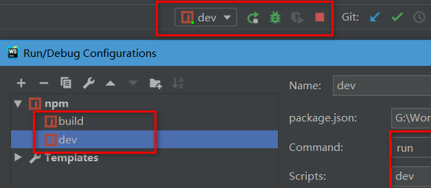
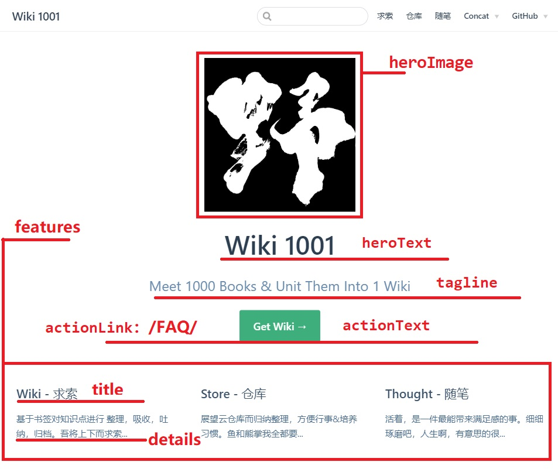
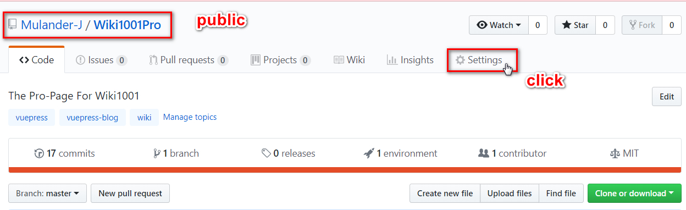
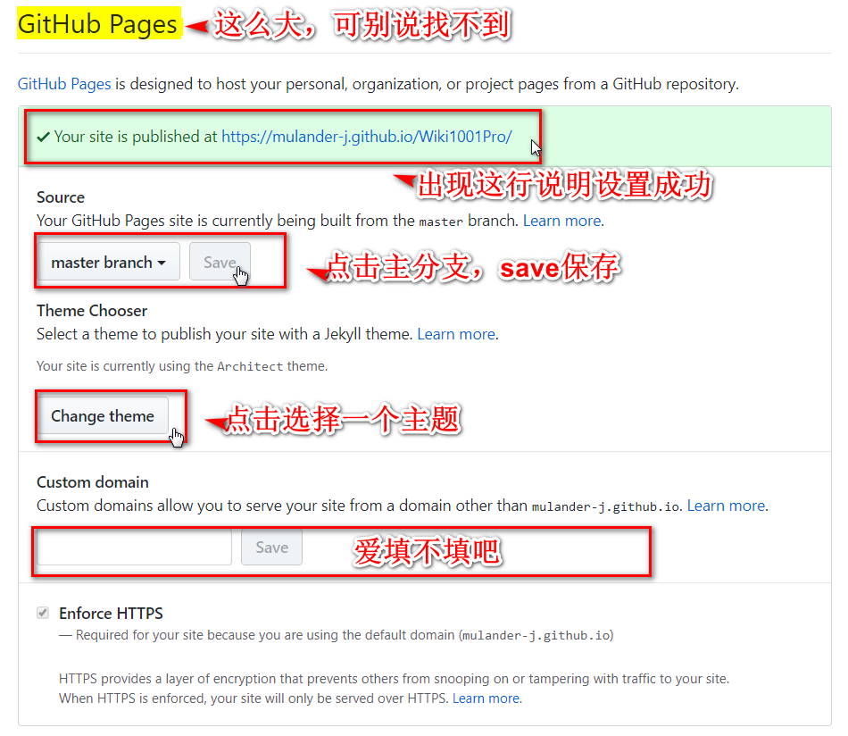
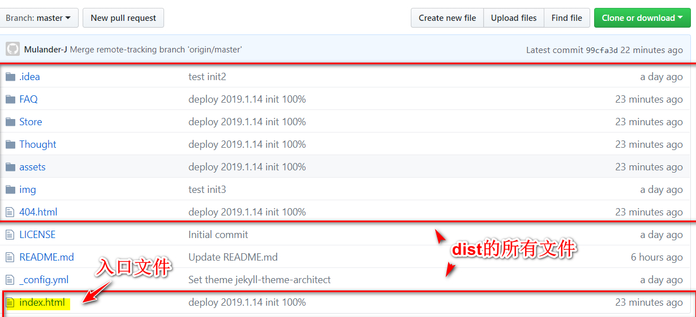

# A001_VuePress博客搭建笔记（一）简单上手 #

::: tip 契子
- 偶尔的整理洁癖
- 平常有收藏+书签的习惯
- github私有仓库免费开放
- 翻看博文 ： [作为软件工程师，如何进行知识管理](https://segmentfault.com/a/1190000017824320)
:::

>前奏较长，不墨迹的可直接跳转至 [开始搭建博客](/FAQ/Console/A001.html#_04-开始搭建博客)

## &01.需求分析 ##

Ok，因为以上的四个契机，因缘巧合鬼使神差地 ，就做出了搭建一个 **实用性** 个人博客的想法。

Well,那就来先分析下基本的需求吧。

- **个人博客** => **博文产出&支持MarkDown格式&方便管理和维护**
- **知识库** => **知识归纳&习惯培养**

初步设定：

- 将各应用中的书签导入到博客中，在博客中有一块区域负责对知识的消化与产出

- 配合对云仓库和随笔这两个模块的管理来培养习惯

## &02.可行性分析 ##

这时我想要的博客是能在 任意场所 任意时间 任意平台 都能打开即食用的，对所有的知识/书签/博文都能做一个快速的查询,而且不想花钱搭建云服务器和云数据库。
正好我目前正在使用vue框架，那么就决定是你了，VuePress ！

基于VuePress搭建的项目有很多，就举最近看到并在食用的这个，[awesome-bookmarks](https://panjiachen.github.io/awesome-bookmarks/)为例，整体满足我的需求，感觉可以的。

...程序员施工中...

目前使用下来看，VuePress上手不算难也不算太简单，花了两天才正式撸出这个blog，还是费了些二虎之力的。

使用的技术点：

- npm
- VuePress
- github

追加技术点：

- vue 
- Regex

## &03.数据源和工具准备 ##
- 数据
    - [awesome-bookmarks](https://panjiachen.github.io/awesome-bookmarks/)
    - [前端最实用书签(持续更新)](https://segmentfault.com/a/1190000016420985)
- 工具
    - [VuePress官方文档](https://vuepress.vuejs.org/zh/)
    - [node.js>=8.0](https://nodejs.org/en/)
    - [Yarn](https://yarn.bootcss.com/)
    - [一个文本编辑器[比如webstorm]](http://www.jetbrains.com/webstorm/)

## &04.开始搭建博客 ##

安装 

1.安装程序 node.js 或者 Yarn。VuePress支持使用Yarn和npm来安装，Node.js版本需要>=8才可以。

此处选择熟悉的工具即可，博主这里用的是npm咯。

2.打开cmd，在控制台输入以下代码：

全局安装VuePress
```bash
yarn global add vuepress # 或者：npm install -g vuepress

## 或者也可以在已存在的项目中开发，将 VuePress 作为一个本地依赖安装，
## 上下两条选择一个即可，博主选择上者，省点折腾。

yarn add -D vuepress # 或者：npm install -D vuepress
```
创建新项目目录
```bash
mkdir project
cd project
```
初始化项目
```bash
yarn init -y # 或者 npm init -y
```
接着，在 package.json 里加一些脚本:
```js{5}
{
  "scripts": {
    "docs:dev": "vuepress dev docs",
    "docs:build": "vuepress build docs"
    /* docs:dev 键值可以自定义修改，此处是为了和一些项目中默认脚本中自带的 dev 区分开。
    如果修改了这个doc:dev 为 mydev，那么下面执行vuepress dev docs的命令就变成了npm run mydev
    npm run mydev 等于在该项目的根目录下执行vuepress dev doc
    vuepress dev doc 做的就是调用安装的vuepress去根据你目录中的.vuepress配置项和docs下的所有.md/。html文件做一个项目的编译和打包
    docs:build 同理 */
  }
}
```
然后就可以开始写作了:
```bash
yarn docs:dev # 或者：npm run docs:dev
```
要生成静态的 HTML 文件，运行：
```bash
yarn docs:build # 或者：npm run docs:build
```
默认情况下，文件将会被生成在 `.vuepress/dist`，当然，你也可以通过 `.vuepress/config.js `中的 `dest` 字段来修改，生成的文件可以部署到任意的静态文件服务器上.

不习惯命令行输入的也可以直接依靠windows可视化操作建立如下工程目录。
```bash
project
├─── docs
│   ├── README.md
└── package.json

```
在README.md中输入一些内容，在package.json中注入脚本命令。并将命令挂载到webstorm的命令配置处。
然后点击运行run dev ，run build 来自动生成.vuepress文件夹


```bash
project
├─── docs
│   ├── README.md
│   └── .vuepress
│       ├── dist
│       ├── public
│       └── config.js
└── package.json
```
不管使用哪种方式，最终的项目结构应该和上面一样。
- docs文件夹是你的根目录，也是vuepress要去解析的文件夹，
- docs下的README.md可以理解为首页页面。
- docs下的.vuepress是一些配置文件，这里可以存放图片等静态资源，一些主题配置，自定义组件等等

至此，一个基于docs文件夹下的README.md文件 生成的页面 就 制作完成了。👏

## &05.config.js基本配置 ##

```js{7}
module.exports = {
    title: 'Wiki 1001', // 页签标题 : A001_VuePress博客搭建的简单教程&问题分析 # | Wiki 1001
    description: '金志相的 Wiki 1001 维基百科', // meta 中的描述文字，意义不大，SEO用
    // 注入到当前页面的 HTML <head> 中的标签
    head: [
        // 增加一个自定义的 favicon(网页标签的图标)
        // 这里的 '/' 指向 docs/.vuepress/public 文件目录 
        // 即 docs/.vuepress/public/img/geass-bg.ico
        ['link', { rel: 'icon', href: '/img/geass-bg.ico' }], 
    ],
    base: '/Wiki1001Pro/', // 这是部署到github相关的配置
    markdown: {
        lineNumbers: true // 代码块显示行号
    },
 }
```
config.js中继续配置主题参数 **顶部导航栏**
```js{9}
module.exports = {
    ...
    themeConfig: {
        sidebarDepth: 4, // 将同时提取markdown中h2 和 h3 标题，显示在侧边栏上。
        lastUpdated: 'Last Updated' ,// 文档更新时间：每个文件git最后提交的时间,
        // 顶部导航栏
        nav:[
             // 单项 text：显示文字，link：指向链接
             // 这里的'/' 指的是 docs文件夹路径
             // [以 '/' 结尾的默认指向该路径下README.md文件]
            { text: '求索', link: '/FAQ/' },  // http://localhost:8080/Wiki1001Pro/FAQ/
            { text: '仓库', link: '/Store/' },
            { text: '随笔', link: '/Thought/' },
            // 多项，下拉形式
            {
                text: 'Concat',
                items: [
                    // link：指向链接也可以是外网链接
                    { text: 'Segmentfault', link: 'https://segmentfault.com/u/mulander' },
                ]
            },
            {
                text: 'GitHub',
                items: [
                    { text: 'GitHub首页', link: 'https://github.com/Mulander-J' },
                    { text: 'Island', link: 'https://mulander-j.github.io/island/code/html/index.html' },
                    { text: 'TimeWaster', link: 'https://mulander-j.github.io/timeWaster/demo/index.html#/' },
                ]
            },
        ],
    }
}
```
config.js中继续配置主题参数 **侧边栏**
```js{15}
module.exports = {
   ...
   themeConfig: {
   ...
    // 侧边栏菜单( 一个模块对应一个菜单形式 )
    sidebar:{
         // 打开FAQ主页链接时生成下面这个菜单
        '/FAQ/':[
            //多级菜单形式
            {
                // 菜单名
                title: '消化堆',
                // 子菜单
                children: [
                    // ['','']=>[路径,标题]
                    // 或者写成 '路径',标题自动识别为该地址的文件中的h1标题
                    // 不以 '/' 结尾的就是指向.md文件             
                    ['/FAQ/DigestionHeap/Digested','消化过'], // '/FAQ/DigestionHeap/Digested.md'文件
                    ['/FAQ/DigestionHeap/Digesting','消化中'],
                    ['/FAQ/DigestionHeap/DigestWill','待消化']
                ]
            },
            {
                title: '输出层',
                children: [
                    ['/FAQ/Console/A001','#A001_VuePress'],
                    ['/FAQ/Console/A002','#A002_插件清单']
                ]
            },
            ['/FAQ/','百科首页'],
            ['/FAQ/Pool/SkillStack','技术栈'],
            ['/FAQ/Pool/Review','归去来']
        ],
         // 打开Thought主页链接时生成下面这个菜单
        '/Thought/':[
            ['/Thought/','随笔首页'],
            {
                title: '游记',
                children: [
                    ['/Thought/Travels/beiPing','北平游记'],
                ]
            },
            {
                title: '年终回顾',
                children: [
                   ['/Thought/YearReview/2018','2018年'],
                   ['/Thought/YearReview/2019','2019年']
                ]
            },
        ],
          // 打开Store主页链接时生成下面这个菜单
        '/Store/': [
            ['','仓库首页'],
            {
                title: '应用',
                children: [
                    ['/Store/Apps/DownDoors', '下载门户'],
                    ['/Store/Apps/OwnTest', '博主测评']
                ]
            },
            {
                title: '电影',
                children: [
                    ['/Store/Films/','收藏级电影']
                ]
            },
            {
                title: '动画',
                children: [
                    ['/Store/Anime/','收藏级动画']
                ]
            },
        ]
    },
}
```
::: danger 注意事项
- 和**图标/图片**等静态资源相关的 其 '/'  默认指向的是 **docs/.vuepress/public/**
- 和**侧边栏/导航栏**相关的地址配置 其 '/'  默认指向的是 **docs/**
- 侧边栏/导航栏指向.md文件的需要**先建立相关.md文件**，不然会报404或者页面空白
:::

## &06.基本目录结构 ##

本博客的工程目录结构-版本以编辑时间为准，

可配合上文 config.js 关联配置

```bash
Dev
├─── docs
│   └── .vuepress   // 配置目录
│   │    ├── public // 静态资源
│   │    ├──── img
│   │    ├────── geass-bg.ico // 图标
│   │    ├────── logo.jpg // 首页logo
│   │    └── config.js
│   ├── FAQ // 求索模块
│   │    ├── Console    // 一级目录 输出层
│   │    │      ├── img    // 博文引用 的 相关图片
│   │    │      │   ├── A001    // A001博文的图片库
│   │    │      │   └──── 001.jpg   
│   │    │      ├── A001.md   
│   │    │      └── A002.md   
│   │    ├── DigestionHeap // 一级目录 消化堆
│   │    │      ├── Digested.md    // 二级目录 消化过
│   │    │      ├── Digesting.md    // 二级目录 消化中
│   │    │      └── DigestWill.md    // 二级目录 待消化
│   │    ├── Pool // 静态池
│   │    │      ├── SkillStack.md    // 技术栈
│   │    │      └── Review.md    // 归去来
│   │    └── README.md  // 求索首页
│   ├── Store
│   │    ├── Anime    // 一级目录 动漫
│   │    │      └── README.md
│   │    ├── Apps // 一级目录 应用
│   │    │      ├── DownDoors.md    //  下载门户
│   │    │      └── OwnTest.md    //  博主测评
│   │    ├── Films // 一级目录 电影
│   │    │      └── README.md
│   │    └── README.md  // 仓库首页
│   ├── Thought
│   │    ├── Travels    // 一级目录 游记
│   │    │      └── beiPing.md   
│   │    ├── YearReview // 一级目录 年终回顾
│   │    │      ├── img    // 博文引用 的 相关图片
│   │    │      │   ├── 2018    // 2018博文的图片库
│   │    │      │   ├──── 001.jpg   
│   │    │      │   ├─——─ 002.jpg   
│   │    │      │   └──── 003.jpg   
│   │    │      ├── 2018.md    
│   │    │      └── 2019.md   
│   │    └── README.md  // 随笔首页
│   └── README.md   // 博客首页
└── package.json
```

## &07.博客首页 ##

```markdown
/docs/README.md

---
home: true
heroImage: /img/logo.jpg
heroText: Wiki 1001
tagline: Meet 1000 Books & Unit Them Into 1 Wiki
actionText: Get Wiki →
actionLink: /FAQ/
features:
- title: Wiki - 求索
  details: 基于书签对知识点进行 整理，吸收，吐纳，归档。吾将上下而求索...
- title: Store - 仓库
  details: 展望云仓库而归纳整理，方便行事&培养习惯。鱼和熊掌我全都要...
- title: Thought - 随笔
  details: 活着，是一件最能带来满足感的事。细细琢磨吧，人生啊，有意思的很...
footer: MIT Licensed | Copyright © 2019.01.11-present Mulander-J
---

```



oops！ 😀 **footer** 没截到 ，应该不用我多讲了吧。

## &08.导入书签 ##
首先，从Chrome浏览器中出的书签是下面这个格式的
  ```html
   <DT><H3 ADD_DATE="1547274523" LAST_MODIFIED="1547274529">myGits</H3>
      <DL><p>
          <DT><A HREF="https://mulander-j.github.io/Wiki1001Pro/index.html" ADD_DATE="1547274505">Wiki 1001</A>
          <DT><A HREF="https://mulander-j.github.io/timeWaster/demo/index.html#/" ADD_DATE="1546489726" ICON="data:image/png;base64,iVBORw0KGgoAAAANSUhEUgAAABAAAAAQCAYAAAAf8/9hAAACpElEQVQ4jT2Su29cZRDFfzPfd+8+/FrjKI4TiEAWiJcQ/AGUdPQpaBB/EhIFDR3/AEKyUAoKkNKBgUgUIGEFRzJ+xbte7+7de785FGs4zZFG8zhnZgzg20dfvNWH9ZIsqgpoWaGqVtz+F1ihi2KGyvHJ5e/286dfv+699AMwCiIwsMAwQLcVtiKBzIyIUD/V3kZ8lqveYGipbEnqmQwzIBkqgQ0yRYXUgG6bmBnuFr2qdnXdpoe6EBRJAgUQgVSaTvW9DZ0PG11Pr2VmEhFShFYiJEXxNtwQELAaD4YRpbD+8ksMHm5zdPGcprQk81VOCEnmDj70UFRm9N1ow0pbTI4pZPXuho0e3LGmbe345tRuFo1pGea9yuglonTmXXRGF4zTgnhlSH+0RswapKC9uGF2Nia5czO+5tKnpNc2meSGq+sxs2VLXlLTlxhO4PjqGTvvPeT+u/u8+PEILQvRBtWgZv+jDzDg6PCI9mrOzvoILPC6WhJAVfd4kHb4+/FTjucXbHz8BtPZDdF0vPPoQ/qjNY4ODimThlyvrtOWFqetb/cS5F7Fq5t77N3b4+TZc07OT1FbmD6/pF7rgSD3KkwgRARkKpAMwyjLjrW7I4S4//4+63dHmBmzf8bMzyas744o8xZPjptTvOC5ZJlJhskk+Xatp9880U+fH8hAucr65cvH+uvgUOu7WyIkd5NhZGXlliVuq7/1KjE/m5AbWMwafvvqe3JV0Y7nJJzZ6eR/C26uIMgWbigQUoSULOnOcMsJaX45JaVEdetfi07myQwLg5SyWQZvs5mnqvYSgZkxyDWD3OfFfMJy0TLsDXAMM8cNJNKg6rPomi6f//nrH7tvvv1JKdo2984oRkBlibU8oO1auhKkBElQBLjZomu6MuW7fwHKV31zU2eghQAAAABJRU5ErkJggg==">TWaster</A>
      </DL><p>
  </DT>
  ```
其次，我对markdown的语法其实不是很熟。

对于链接的写法我直接复制过来的如下:
```markdown
[链接][1]

[1]: https://link/
```
emm...这样写我几百个书签岂不是要编号编到死哦。😂

于是我取巧了下，用下面这种vue写法替代
```html
<ul>
    <li  v-for="a in [
    {title:'让我帮你百度一下',url:'http://baidu.apphb.com/'},
    {title:'Kaspersky Cyberthreat',url:'https://cybermap.kaspersky.com/'},
    {title:'Breathingearth',url:'http://www.breathingearth.net/'}
    ]">
        <a :href='a.url' target='_blank'>{{a.title}}<svg xmlns="http://www.w3.org/2000/svg" aria-hidden="true" x="0px" y="0px" viewBox="0 0 100 100" width="15" height="15" class="icon outbound"><path fill="currentColor" d="M18.8,85.1h56l0,0c2.2,0,4-1.8,4-4v-32h-8v28h-48v-48h28v-8h-32l0,0c-2.2,0-4,1.8-4,4v56C14.8,83.3,16.6,85.1,18.8,85.1z"></path> <polygon fill="currentColor" points="45.7,48.7 51.3,54.3 77.2,28.5 77.2,37.2 85.2,37.2 85.2,14.9 62.8,14.9 62.8,22.9 71.5,22.9"></polygon></svg></a>
    </li>
</ul>
```
这样写确实比编着号写方便，但是语义不强，阅读性和维护性不太好。

直到我突然看到了这种写法

```markdown
[链接](http://alink.com)
```
WTF?!🤬 🌶真的难受，我写了一半了欸。

为了完整性和一致性，改回来！！！

那么怎么把chrome的书签导入到markdown里呢？我是这样做的
```html
<DL><p>
    <DT><A HREF="https://mulander-j.github.io/Wiki1001Pro/index.html" ADD_DATE="1547274505">Wiki 1001</A>
    <DT><A HREF="https://mulander-j.github.io/timeWaster/demo/index.html#/" ADD_DATE="1546489726" ICON="data:image/png;base64,iVBORw0KGgoAAAANSUhEUgAAABAAAAAQCAYAAAAf8/9hAAACpElEQVQ4jT2Su29cZRDFfzPfd+8+/FrjKI4TiEAWiJcQ/AGUdPQpaBB/EhIFDR3/AEKyUAoKkNKBgUgUIGEFRzJ+xbte7+7de785FGs4zZFG8zhnZgzg20dfvNWH9ZIsqgpoWaGqVtz+F1ihi2KGyvHJ5e/286dfv+699AMwCiIwsMAwQLcVtiKBzIyIUD/V3kZ8lqveYGipbEnqmQwzIBkqgQ0yRYXUgG6bmBnuFr2qdnXdpoe6EBRJAgUQgVSaTvW9DZ0PG11Pr2VmEhFShFYiJEXxNtwQELAaD4YRpbD+8ksMHm5zdPGcprQk81VOCEnmDj70UFRm9N1ow0pbTI4pZPXuho0e3LGmbe345tRuFo1pGea9yuglonTmXXRGF4zTgnhlSH+0RswapKC9uGF2Nia5czO+5tKnpNc2meSGq+sxs2VLXlLTlxhO4PjqGTvvPeT+u/u8+PEILQvRBtWgZv+jDzDg6PCI9mrOzvoILPC6WhJAVfd4kHb4+/FTjucXbHz8BtPZDdF0vPPoQ/qjNY4ODimThlyvrtOWFqetb/cS5F7Fq5t77N3b4+TZc07OT1FbmD6/pF7rgSD3KkwgRARkKpAMwyjLjrW7I4S4//4+63dHmBmzf8bMzyas744o8xZPjptTvOC5ZJlJhskk+Xatp9880U+fH8hAucr65cvH+uvgUOu7WyIkd5NhZGXlliVuq7/1KjE/m5AbWMwafvvqe3JV0Y7nJJzZ6eR/C26uIMgWbigQUoSULOnOcMsJaX45JaVEdetfi07myQwLg5SyWQZvs5mnqvYSgZkxyDWD3OfFfMJy0TLsDXAMM8cNJNKg6rPomi6f//nrH7tvvv1JKdo2984oRkBlibU8oO1auhKkBElQBLjZomu6MuW7fwHKV31zU2eghQAAAABJRU5ErkJggg==">TWaster</A>
</DL><p>

```
- 1. Ctrl+F 或者 Ctrk+R 唤出文档寻找和替换菜单 
- 2. 输入 `" ADD_DATE[^>]*">` 替换为 `)[`
- 3. 输入 `<DT><A HREF="`  替换为 `(`
- 4. 输入 `<DL><p>` 替换为 ''
- 5. 输入 `</DL><p>` 替换为 ''
得到结果如下
```html
(http://alink.com)[链接]
```
- 6.然后选中链接或者链接标题移动一下就可以了。
这样所有的链接都出来了，只是要每个都去加回车换行和互换前后顺序。

如果有其他更好的方法，可以去[github](https://github.com/Mulander-J/Wiki1001Pro)上给我留言~

## &09.挂载GitHub ##
因为这段时间github私有仓库免费开放了，我亲自试了下，公有私有互相切换是真的丝滑，真香！

所以这个博客工程也就尝试性地放到了私有仓库里，

又因为私有仓库不能创建github-page，所以我只好创建了一个对应的公有仓库用来存放dist静态站点。

同时，也很好地区分开了开发环境与生产环境

嗯，这么解释就舒服多了，一点也不麻烦🤪

- 建立一个公有仓库 ： https://github.com/Mulander-J/Wiki1001Pro

- 在 **setting** 里设置好github-page属性

- docs/.vuepress/config.js 中配置 对应仓库名 Wiki1001Pro
```js
base: '/Wiki1001Pro/'// 这是部署到github相关的配置
```
- 将build获得地dist文件夹上传至github

- 访问https://github.com/Mulander-J/Wiki1001Pro/index.html
## &10.其他配置 ##

详细的目前还没有试过就不继续写了，走到这里的话应该能搭建出和本博客一样的站点了。
具体的可以去网上继续学习研究
- [VuepPress官网](https://vuepress.vuejs.org/zh/plugin/official/plugin-search.html)
- [使用VuePress搭建一个类型element ui文档](https://blog.csdn.net/qq_30227429/article/details/80567745)
- [Vuepress搭建带有评论系统的博客](https://blog.csdn.net/HookJony/article/details/82027550)
