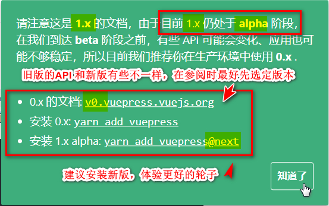
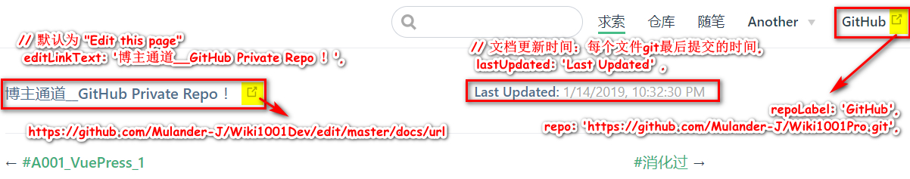
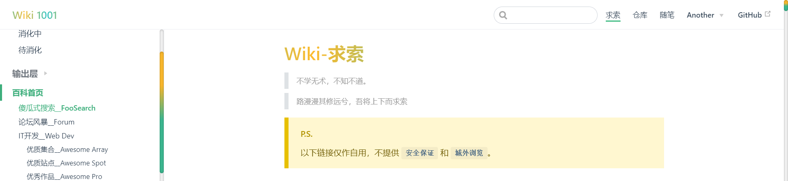
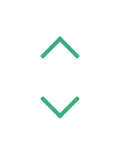
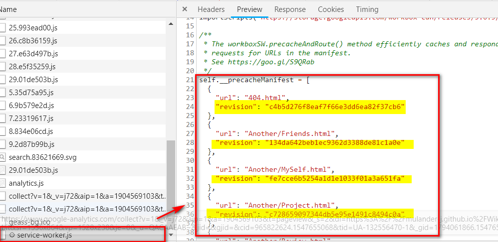
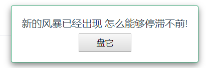
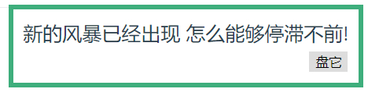
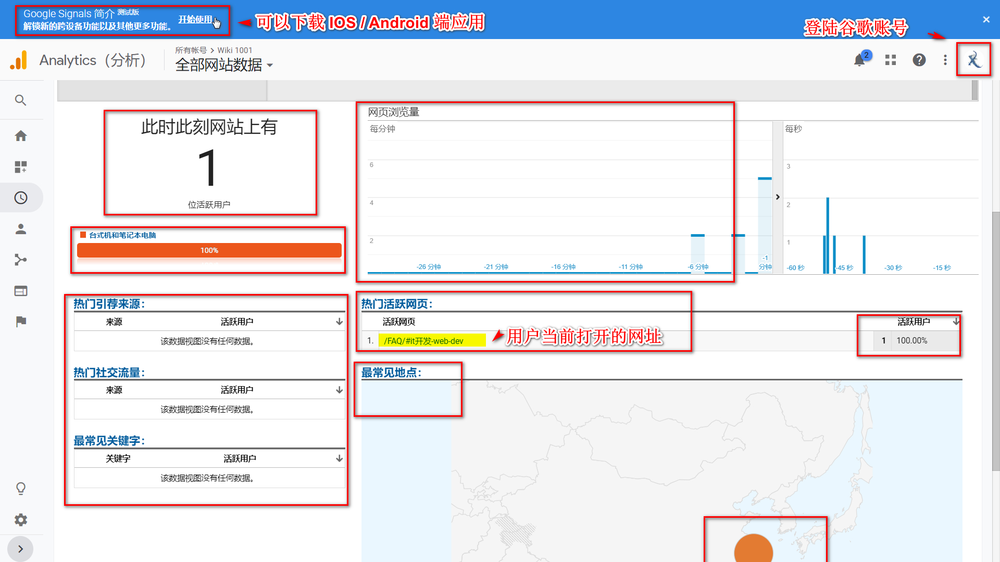

# A002_VuePress博客搭建笔记（二）个性化配置 #

## &00.上文回顾 ##

在上文 [A001_VuePress博客搭建笔记（一）简单上手](https://mulander-j.github.io/Wiki1001Pro/FAQ/Console/A001.html) 
中，我简单阐述了**VuePress**博客搭建的过程，并对其中的一些问题进行分析记录，
包括**首页**，**侧边栏**，**导航栏**，**浏览器书签引入**，**挂载githubPage**等等。

本文将围绕着博客的**个性化配置**作一个整理。

首先引用官网的原文重申一次**VuePress**博客搭建的过程：

::: tip Start
 **As Easy as 1, 2, 3**
:::

```bash
# install
yarn global add vuepress@next 
# OR npm install -g vuepress@next

# create a markdown file
echo '# Hello VuePress' > README.md

# start writing
vuepress dev

# build to static files
vuepress build

```

## &01.版本推荐 ##

**VuePress**的官网目前是存在两个版本的，分别为0.x版本和最新的1.x的alpha版本。
在实际开发中，我经常因为混淆版本而导致一些插件不能正常引入，当然这也是因为我对**VuePress**的使用还不熟练。
打开**VuePress**的官网，如果有下面绿色的Notice弹出，说明是1.x版本。



- 0.x 的文档: [v0.vuepress.vuejs.org](https://v0.vuepress.vuejs.org/)

- 1.x 的文档: [v1.alpha.vuepress.vuejs.org](https://vuepress.vuejs.org/zh/)

如果是开发者，建议安装最新版**VuePress**，体验最新的轮子~

```bash
yarn add vuepress -D       # Install 0.x.x.
yarn add vuepress@next -D  # Install next.
```

## &03.Github链接  ##

与github关联的页脚链接和导航栏链接，

```js{2}
/**
* config.js
* @type {{themeConfig: {lastUpdated: string, repoLabel: string, 
* docsDir: string, repo: string, editLinkText: string, 
* docsRepo: string, editLinks: boolean, docsBranch: string}}}
*/
module.exports = {
    // ...
    themeConfig: {
        // 假定是 GitHub. 同时也可以是一个完整的 GitLab URL
        repo: 'https://github.com/Mulander-J/Wiki1001Pro.git',
        // 自定义仓库链接文字。默认从 `themeConfig.repo` 中自动推断为
        // "GitHub"/"GitLab"/"Bitbucket" 其中之一，或是 "Source"。
        repoLabel: 'GitHub',
        // 以下为可选的编辑链接选项
        // 假如你的文档仓库和项目本身不在一个仓库：
        docsRepo: 'https://github.com/Mulander-J/Wiki1001Dev',
        // 假如文档不是放在仓库的根目录下：
        docsDir: 'docs',
        // 假如文档放在一个特定的分支下：
        docsBranch: 'master',
        // 默认是 false, 设置为 true 来启用
        editLinks: true,
        // 默认为 "Edit this page"
        editLinkText: '博主通道__GitHub Private Repo ！',
        // 文档更新时间：每个文件git最后提交的时间,
        lastUpdated: 'Last Updated' ,
    }
}
```


## &04.个性化主题 ##

### 主题修改 ###

- 下载默认主题
```bash
npm install @vuepress/theme-default@next
```
- 替换
```bash
##复制node_modules/@vuepress/theme-default 文件夹
##粘贴至.vuepress/ 下并更名为theme

Dev
├─── docs
│   └── .vuepress   // 配置目录
│   │    ├── public // 静态资源
│   │    ├── theme // 主题
│   │    │   ├── components // 组件
│   │    │   ├── global-components // 全局组件
│   │    │   ├── global-components // 全局组件
│   │    │   ├── layouts // 布局(包括首页在内)
│   │    │   ├── styles // 样式
│   │    │   ├── util // 工具
│   │    │   ├── index.js // 入口配置
│   │    │   ├── noopModule.js // 依赖注入
│   │    │   ├── package.json // 主题依赖
│   │    │   ├── README.md // 主题说明
│   │    └── config.js
│   ├── FAQ     // 求索模块
│   ├── Store   // 仓库模块
│   ├── Thought // 随笔模块
│   └── README.md   // 博客首页
└── package.json
```
- 运行
```bash
npm run dev
```
关注控制台输出

 ``tip Apply theme located at G:\WorkSpace\WebStormWS\Wiki1001\Dev\docs\.vuepress\theme...``
 
 若果控制台能看到上面这句话或者页面能正常渲染的话，就表示主题引入成功
 
```bash
"C:\Program Files\nodejs\node.exe" "C:\Program Files\nodejs\node_modules\npm\bin\npm-cli.js" run dev --scripts-prepend-node-path=auto

> wiki1001@1.0.0 dev G:\WorkSpace\WebStormWS\Wiki1001\Dev
> vuepress dev docs

wait Extracting site metadata...
tip Apply theme located at G:\WorkSpace\WebStormWS\Wiki1001\Dev\docs\.vuepress\theme...
```
接下来就可以对这份theme项目作修改了，

它就是载负你的博客的一个简单的VUe单页面项目。

### 滚动条样式 ### 

设置页面滚动条为渐变色&圆角样式

> 参考
>- [CSS进阶篇--设置滚动条样式](https://segmentfault.com/a/1190000003708894)



```css{0}
/*定义滚动条高宽及背景 高宽分别对应横竖滚动条的尺寸*/
::-webkit-scrollbar
{
  width: 8px;
  height: 8px;
  border-radius: 10px;
  background-color: #F5F5F5;
}

/*定义滚动条轨道 内阴影+圆角*/
::-webkit-scrollbar-track
{
  border-radius: 10px;
  -webkit-box-shadow: inset 0 0 6px rgba(0,0,0,0.3);
  background-color: #F5F5F5;
}

/*定义滑块 内阴影+圆角*/
::-webkit-scrollbar-thumb
{
  border-radius: 10px;
  -webkit-box-shadow: inset 0 0 6px rgba(0,0,0,.3);
  border-radius: 10px;
  /* 线性渐变 */
  background-image: -webkit-gradient(linear, 
  left bottom, left top,
   color-stop(0.44, rgb(60,186,146)), 
   color-stop(0.72, rgb(253,187,45)), 
   color-stop(0.86, rgb(253,187,45)));
  transition: 0.3s ease-in-out;
}
/*定义滑块悬浮样式*/
::-webkit-scrollbar-thumb:hover{
  background-image: -webkit-gradient(linear, 
  left bottom, left top, 
  color-stop(0.44, rgb(253,187,45)), 
  olor-stop(0.72, rgb(253,187,45)), 
  color-stop(0.86, rgb(60,186,146)));
  transition: 0.3s ease-in-out;
}

```

### 渐变色标题 ###


```css{0}
h1{
  background-image: -webkit-linear-gradient(left,
   #22c1c3, #fdbb2d 25%, #22c1c3 50%, #fdbb2d 75%, #22c1c3);
  -webkit-text-fill-color: transparent;
  -webkit-background-clip: text;
  -webkit-background-size: 200% 100%;
  -webkit-animation: myGradientChange 4s infinite linear;
  animation: myGradientChange 4s infinite linear;
}
.description,.card h2{
  background-image: -webkit-linear-gradient(left,
   #fdbb2d, #22c1c3 25%, #fdbb2d 50%, #22c1c3 75%, #fdbb2d);
  -webkit-text-fill-color: transparent;
  -webkit-background-clip: text;
  -webkit-background-size: 200% 100%;
  -webkit-animation: myGradientChange 4s infinite linear;
  animation: myGradientChange 4s infinite linear;
}
@keyframes myGradientChange  {
  0%{ background-position: 0 0;}
  100% { background-position: -100% 0;}
}
```
### GoToEnd ###



- 下载官方组件BackToTop
```bash
npm install @vuepress/plugin-back-top@next
```
- 本地化BackToTop组件至Layout.vue中，包括首页在内都会生产该组件
```vue{0}
//  复制node_modules/@vuepress/plugin-back-top/BackToTop.vue
//  粘贴至.vuepress/theme/components
<template>
  <div>
    <BackToTop></BackToTop>
  </div>
</template>

<script>
import BackToTop from '../components/BackToTop.vue'
export default {
  components: { BackToTop},
}
</script>

```
- 修改Back To Top 组件

复制一个Back To Top DOM节点同时修改 **transition** 为 **transition-group**
```vue{0}
<template>
  <transition-group name="fade">
    <svg
      v-if="topShow"
      class="go-to-top"
      key="goTop"
      @click="scrollToTop"
      xmlns="http://www.w3.org/2000/svg" viewBox="0 0 49.484 28.284"
    >
      <g transform="translate(-229 -126.358)">
        <rect fill="currentColor" width="35" height="5" rx="2" transform="translate(229 151.107) rotate(-45)"/>
        <rect fill="currentColor" width="35" height="5" rx="2" transform="translate(274.949 154.642) rotate(-135)"/>
      </g>
    </svg>
    <svg
            v-if="endShow"
            class="go-to-top go-to-end"
            @click="scrollToEnd"
            key="goEnd"
            xmlns="http://www.w3.org/2000/svg" viewBox="0 0 49.484 28.284"
    >
      <g transform="translate(-229 -126.358)">
        <rect fill="currentColor" width="35" height="5" rx="2" transform="translate(229 151.107) rotate(-45)"/>
        <rect fill="currentColor" width="35" height="5" rx="2" transform="translate(274.949 154.642) rotate(-135)"/>
      </g>
    </svg>
  </transition-group>
</template>
```
增加 变量 **scrollEnd** , **endShow** 

方法 **getScrollEnd()** ,**scrollToEnd()**

```vue{0}
<script>
import debounce from 'lodash.debounce'
export default {
  props: {
    threshold: {
      type: Number,
      default: 300
    }
  },
  data () {
    return {
      scrollTop: null,
      scrollEnd: null
    }
  },
  mounted () {
    this.scrollTop = this.getScrollTop()
    this.scrollEnd = this.getScrollEnd()
    window.addEventListener('scroll', debounce(() => {
      this.scrollTop = this.getScrollTop()
      this.scrollEnd = this.getScrollEnd()
    }, 100))
  },
  methods: {
    getScrollTop () {
      return window.pageYOffset ||
        document.documentElement.scrollTop ||
        document.body.scrollTop || 0
    },

    getScrollEnd () {
      return document.documentElement.scrollHeight ||
              document.body.scrollHeight || this.threshold
    },
    scrollToTop () {
      window.scrollTo({ top: 0, behavior: 'smooth' })
      this.scrollTop = 0
    },

    scrollToEnd () {
      window.scrollTo({ top: this.scrollEnd, behavior: 'smooth' })
      this.scrollTop = this.scrollEnd
    }
  },
  computed: {
    topShow () {
      return this.scrollTop > this.threshold
    },
    endShow () {
      return (this.scrollEnd - this.scrollTop) > 3*this.threshold
    }
  }
}
</script>
```
增加置底按钮样式，z轴旋转180度
```vue{0}
<style lang='stylus' scoped>
.go-to-top {
  cursor: pointer;
  position: fixed;
  bottom: 5rem;
  right: 2.5rem;
  width: 2rem;
  color: $accentColor;
  z-index: 1;
}
.go-to-end{
  bottom: 2rem;
  transform: rotateZ(180deg);
}
.go-to-top:hover {
  color: lighten($accentColor, 30%);
}

@media (max-width: 959px) {
  .go-to-top {
    display: none;
  }
}
.fade-enter-active, .fade-leave-active {
  transition: opacity 0.3s;
}
.fade-enter, .fade-leave-to {
  opacity: 0;
}
</style>
```
## &05.插件-PWA ##
```bash
yarn add -D @vuepress/plugin-pwa
# OR npm install -D @vuepress/plugin-pwa
```
```js{0}
//config,js
module.exports = {
// ...
 plugins: [
    ['@vuepress/pwa', {
        serviceWorker: true,
        //指向自定义组件
        popupComponent: 'MySWUpdatePopup',
        updatePopup: {
            message: "新的风暴已经出现",
            buttonText: "盘他"
        }
    }]
 ]
}
```
serviceWorker的作用大致就页面首次加载时会请求本地的serviceWorker.js去比对各个文件的版本号
如果不一致则提示用户拉取更新

不过这个popup的默认样式很丑😨，所以官方也提供了自定义popup的接口和教程
:::danger 默认样式
这是原始的...eh
:::

:::warning 官网Demo
这是官网给的模板 = = 阿咧？
:::

::: tip 我的Demo
这是我的...emmm..可还行呢，凑合用了。这个vue的logo还会动的，不算侵权吧😱...@Vue??
    
P.S.这个popup 的内容是我自定义写的，不是官方在皮啊
>参考 
>- [前端每日实战：4# 视频演示如何用纯 CSS 创作一个金属光泽 3D 按钮特效](https://segmentfault.com/a/1190000014599280)
>- [前端每日实战：43# 视频演示如何用纯 CSS 绘制一个充满动感的 Vue logo](https://segmentfault.com/a/1190000015177284)
:::

:::danger 注意
``v-if="enabled"`` // 添加这一段指令，否则popup无法消失
```vue{2}
<SWUpdatePopup>
    <div   v-if="enabled" 
            slot-scope="{ enabled, reload, message, buttonText }"
            class="my-sw-update-popup">
        {{ message }}<br>
        <button @click="reload">{{ buttonText }}</button>
    </div>
</SWUpdatePopup>
```
:::

## &06.插件-google-analytics ##

- ~~首先你要有一个谷歌账号，~~
- ~~然后有一个 google analytics（GA）账户~~
- ~~然后...~~
- ~~不用麻烦了不用麻烦了~~
- ~~不用麻烦 不用麻烦了 不用麻烦了~~
- ~~你们一起上 我在赶时间~~
- [如何注册并设置google analytics（GA）账户](https://jingyan.baidu.com/article/066074d6093cf8c3c21cb0e3.html)
- **GA-ID ゲットだゼーツ！**



- 安装并使用 **google_analysis**

```bash
yarn add -D @vuepress/plugin-google-analytics
# OR npm install -D @vuepress/plugin-google-analytics
```
```js{0}
//config.js
module.exports = {
...
  plugins: [
    ['@vuepress/google-analytics', {
        ga: '*********'//你的Google Analytics ID
    }],
  ]
}
```
**google_analysis** 会实时监控你的**url**，倘若一个页面有多个h2,h3标题，滑动滚动条导致**url**的变化也会被捕捉到。


## &07.评论系统-Valine ##

>参考 
> - [Vuepress搭建带有评论系统的博客](https://blog.csdn.net/HookJony/article/details/82027550)
> - [A fast, simple & powerful comment system. Valine](https://valine.js.org/)

- 获取APP ID 和 APP Key,请先登录或注册 **LeanCloud**, 进入控制台后点击左下角创建应用
- 安装并使用 **Valine**
```bash
# Install leancloud's js-sdk
npm install leancloud-storage --save
# Install valine
npm install valine --save
```
```js{0}
// Register AV objects to the global
window.AV = require('leancloud-storage');
// Use import
import Valine from 'valine';
// or Use require
const Valine = require('valine');
new Valine({
    el:'#vcomments',
    // other config
})
```
```vue{0}
//Page.vue
<script>
export default {
     mounted: function(){
        // require window 
        const Valine = require('valine');
        if (typeof window !== 'undefined') {
          this.window = window
          window.AV = require('leancloud-storage')
        }
        new Valine({
          el: '#vcomments' ,
          appId: '',// your appId
          appKey: '', // your appKey
          notify:false, //邮箱通知，可关闭
          verify:false, //反人类的算术验证码，建议关闭
          avatar:'mm', //头像，默认即可
          visitor: true,//访问计数
          placeholder: 'just go go' 
        });
      }
}
</script>
```
::: warning Issue
不管地址栏怎么变化，不管怎么切页面，评论内容不会随地址栏变化而变化，即无法同步。

**Valine**实例与**leancloud-storage**实例 在每次页面加载时会向服务器发起
带当前url参数的请求以获取评论数据，而这个url参数每次都是一样。
:::

首先**Valine** 实例与 **leancloud-storage** 实例都在 **mounted** 钩子中初始化或挂载至 **window** 对象上了，

当页面 **url** 变化时，**Page.vue** 本身并没有变化，只是它身上的`<Content/>`内容变了，**mounted**没有重新触发，上面两个实例也没有改变。
::: danger 血的教训
不要在 md 文件中直接写`<Content/>`,请用其他格式编译它，否则会被**vuepress**识别为组件而不断加载陷入死循环。
```js{0}
[Vue warn]: Error in nextTick: "RangeError: Maximum call stack size exceeded"
warn @ vue.runtime.esm.js?2b0e:601
vue.runtime.esm.js?2b0e:1832 RangeError: Maximum call stack size exceeded
```
```markdown{2}
只是它身上的<Content/>内容变了，
只是它身上的`<Content/>`内容变了，
```
:::
- 如果重新 init 两个实例呢？
    - 通过 **watch $route** 重新 **new** 两个实例也不行。
    - 在每个页面的写入 带 **Valine** 的.vue组件也不行。
    
暂时无法解决...emmm,欲知后事如何，请听下回分解..

欸，应该没有（三）了，等解决了直接写在评论里吧。    

大家有解决方法的话也欢迎在下方留言，留言前请 **【 F5 】** 刷新下确保评论会提交到当前页面😂😂😂

---

## &解决Valine不随页面刷新 ##

 Page.vue 改动如下：

```js{0}
//  docs/.vuepress/theme/components/Page.vue
<script>
import...
export default {
   // 初始化Valine组件
  mounted() {
    this.renderValine()
  },
  watch :{
     // 路由变化时重新初始化Valine组件
    $route (a,b) {
      if(a.path!=b.path){
        this.renderValine()
      }
    }
  },
 methods: {
    //  生成评论组件的 Dom 元素
    renderValine () {
    //  因为此方法会构建dom节点，所以<template>中不需要再加相关dom元素
      let $page = document.querySelector('.page')
      let vcomments = document.getElementById('vcomments')
      if(!vcomments){
        vcomments = document.createElement('div')
        vcomments.id = 'vcomments'
      }
      if(this.$page.frontmatter.hideFooter){
      //    如果forntmatter中标注'hideFooter：true'则不渲染评论组件，
      //    使得评论组件在各个页面的显示可控
        vcomments.remove();
      }else{
        if ($page && !vcomments){
          $page.appendChild(vcomments)
        }else{
          $page = document.querySelector('.page')
          $page.appendChild(vcomments)
        }
        this.valine()
      }
    },
    //  初始化valine实例
    valine () {
      const Valine = require('valine')
      const leancloudStorage = require('leancloud-storage')
      // require window
      if (typeof window !== 'undefined') {
        window.AV = leancloudStorage
      }
      //    配置valine参数
      new Valine({
        el: '#vcomments' ,
        appId: '',// your appId
        appKey: '', // your appKey
        notify:true,
        verify:false,
        visitor: true,
        avatar:'wavatar',
        placeholder: '春霄苦短，少女前进吧！' +'\n'+
                '夜は短し歩けよ乙女！' +'\n'+
                'Yoru wa Mijikashi Arukeyo Otome!' +'\n'+
                'The Night is Short, Walk on Girl!',
        path: window.location.pathname
      });
    },
  }
```


