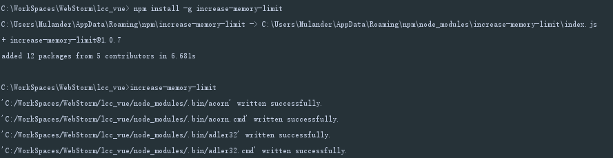
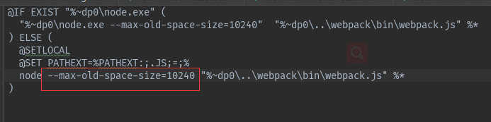
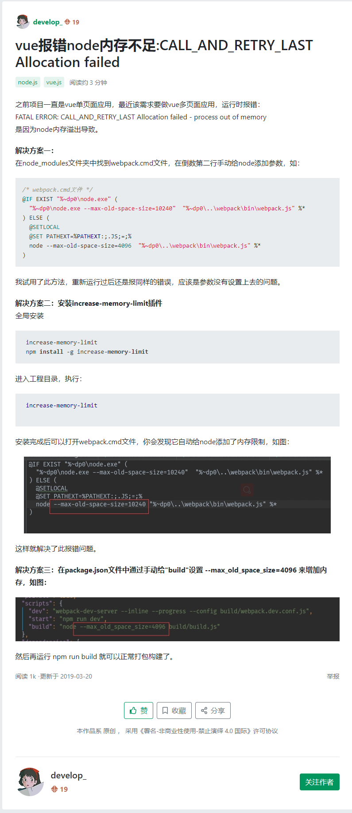

# D001_node内存溢出解决方案 #

>vue报错node内存不足:CALL_AND_RETRY_LAST Allocation failed
> - [转载地址](https://segmentfault.com/a/1190000018557398) 
> - [原作者:develop_](https://segmentfault.com/u/develop_)
> - [原文快照](#快照)


之前项目一直是vue单页面应用，最近该需求要做vue多页面应用，运行时报错：
FATAL ERROR: CALL_AND_RETRY_LAST Allocation failed - process out of memory
是因为node内存溢出导致。

## &解决方案一
在**node_modules**文件夹中找到**webpack.cmd**文件，在倒数第二行手动给**node**添加参数，如：
```
/* webpack.cmd文件 */
@IF EXIST "%~dp0\node.exe" (
  "%~dp0\node.exe --max-old-space-size=10240"  "%~dp0\..\webpack\bin\webpack.js" %*
) ELSE (
  @SETLOCAL
  @SET PATHEXT=%PATHEXT:;.JS;=;%
  node --max-old-space-size=4096  "%~dp0\..\webpack\bin\webpack.js" %*
)
```
我试用了此方法，重新运行过后还是报同样的错误，应该是参数没有设置上去的问题。

## &解决方案二|推荐
安装increase-memory-limit插件
全局安装
 ```bash
  # increase-memory-limit
  npm install -g increase-memory-limit
 ```
进入工程目录，执行：
```bash
 increase-memory-limit
```
如图：


安装完成后可以打开webpack.cmd文件，你会发现它自动给node添加了内存限制，如图：

这样就解决了此报错问题。

## &解决方案三
在**package.json**文件中通过手动给"**build**"设置 `--max_old_space_size=4096` 来增加内存，
```json
{
    "scripts": {
        "dev": "webpack-dev-server --inline --progress --config build/webpack.dev.conf.js",
        "build": "node --max_old_space_size=4096 build/build.js"
    }
}
```
然后再运行 npm run build 就可以正常打包构建了。

## 快照

